# Лабораторная работа №6

# Система контроля версий

**Цель лабораторной работы:** изучение базовых возможностей системы
управления версиями, опыт работы с Git Api, опыт работы с локальным и
удаленным репозиторием.

Настроила клиент git, введя имя пользователя и email с помощью команд `git config --global user.name "text"` и `git config --global user.email "text"`

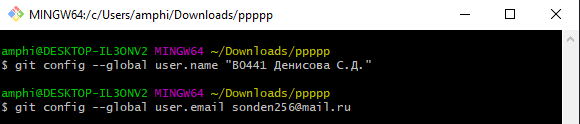

Клонировала удалённый репозиторий на компьютер с помощью команды `git clone <url>`

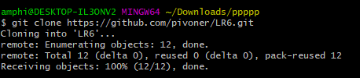

Добавила файл через интерфейс GitHub.

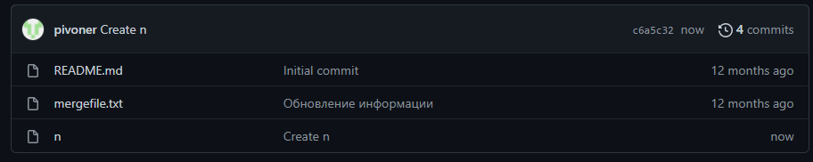

Подтянула изменения в локальный репозиторий с помощью команды `git pull`

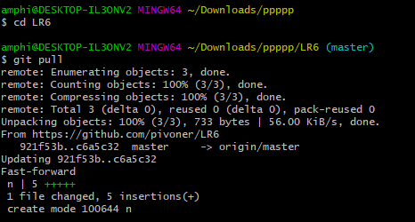

Получила историю операций для ветки master с помощью команды `git log`

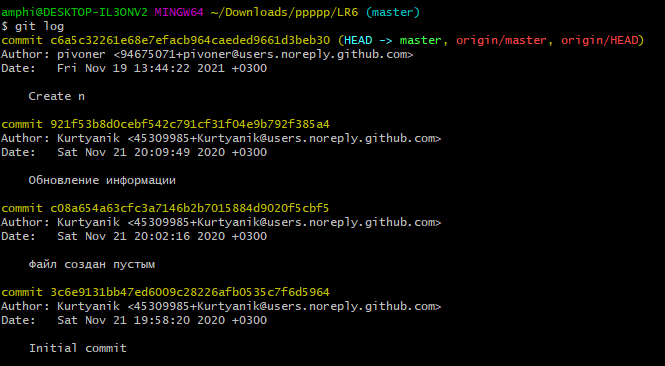

Перешла в branch1 с помощью команды `git checkout branch1` и получила историю операций для ветки branch1 с помощью команды `git log`

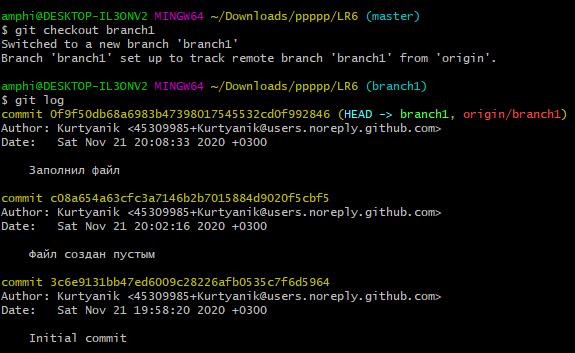

Перешла обратно в master с помощью команды `git checkout master` и выполнила слияние в master с помощью команды `git merge branch1`, но получила конфликт

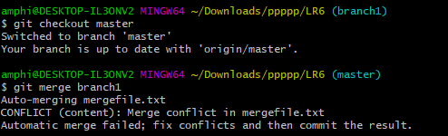

Ввела `git status` и по совету использовала `git add <file>`. Сохранила результат с помощью `git commit -m merging`. Удалила побочную ветку после успешного слияния с помощью `git branch -d branch1`

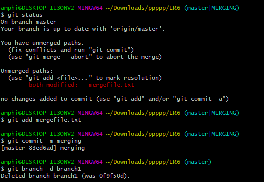

Добавила файл "yoy.txt" в репозиторий и отследила это с помощью `git add <file>`. Зафиксировала изменение командой `git commit -m "comm"`

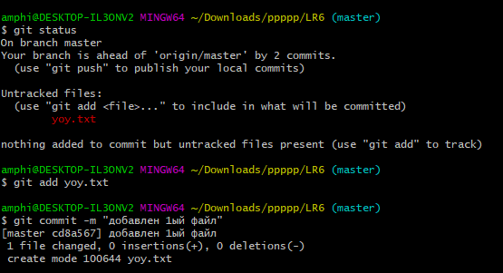

Добавила файл "yoy2.txt" и проделала ту же работу для него.

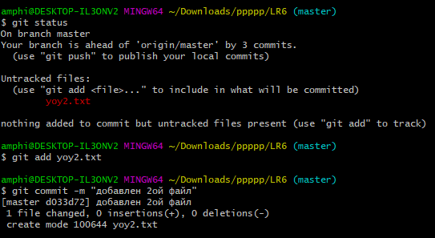

Смотрим историю операций с помощью `git log`

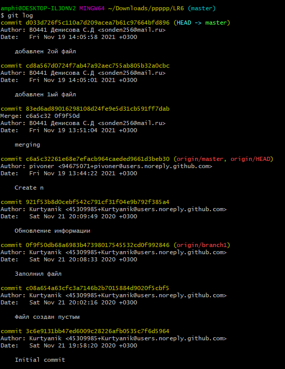

Делаем "хард" откат коммита с помощью `git reset --hard HEAD~1` и смотрим историю операций

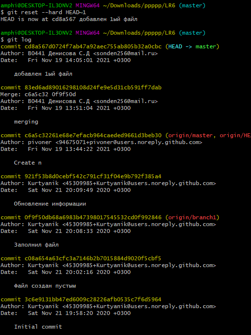

Создаём ветку для отчёта с помощью `git branch report` и переходим в неё. 

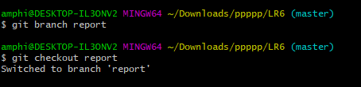

Добавила в репозиторий отчёт и папку со скриншотами и зафиксировала. 

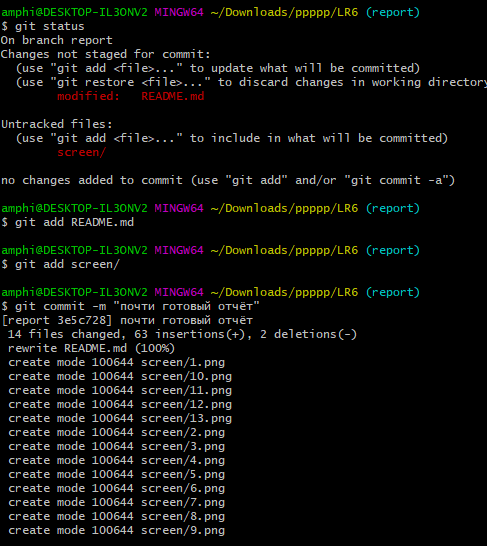

Отправила локальные изменения в сетевое хранилище GitHub с помощью `git push --set-upstream origin report`

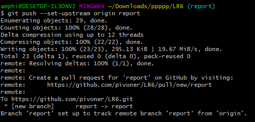

Вывела итоговую историю операций в форматированном виде с помощью `git log --pretty=format:"%h - %ar - %an - %s"`

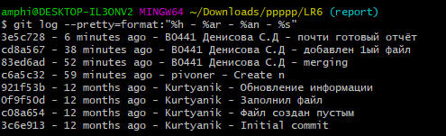